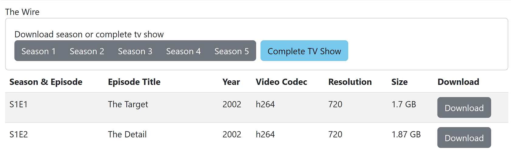
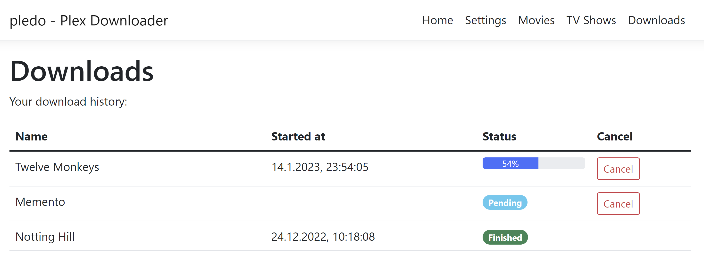

# pledo - Plex Downloader

This is a simple downloader for movies and tv shows of accessible plex media servers.
If you either want a copy of your friends media or your bandwidth cant just handle a stream - this can be your solution.
Deploy on your media server as container and access by web frontend.

Focused on proper functioning rather than good looking design. Features:
- .Net backend + React.js frontend 
- Log in by plex.tv, no need for typing in password into this app
- Sync all media metadata of all accessible servers, backed by local db
- Browse all media, select and download directly
- Download
  - movies
  - tv shows, seasons or single episodes
  - playlists
- Supports multiple file versions (e.g. in different resolutions / codecs)
- Docker image for amd64 and arm64. Or run the windows executable .

Use `docker pull ghcr.io/fxsth/pledo:latest` to get the docker image of latest release.

### Docker Compose Example
```yaml
version: "3"

services:
  pledo:
    image: ghcr.io/fxsth/pledo:latest
    container_name: plex-downloader
    volumes:
      - /config/pledo:/config
      - /media/Movies:/movies
      - /media/Tv-Shows:/tvshows
    ports:
      - 23456:80
    restart: unless-stopped
```
Directory /config is used for storing database and local configuration. If not available, it will default to SpecialFolder.LocalApplicationData/.pledo

---
### Download multiple episodes with one click


### Download history

